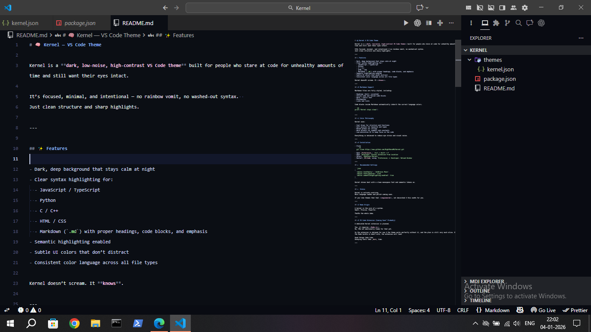
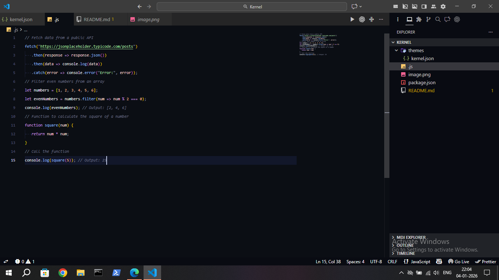

# 🧠 Kernel — VS Code Theme

Kernel is a **dark, low-noise, high-contrast VS Code theme** built for people who stare at code for unhealthy amounts of time and still want their eyes intact.

It’s focused, minimal, and intentional — no rainbow vomit, no washed-out syntax.  
Just clean structure and sharp highlights.

---

## Images

### MarkDown Example


### JavaScript Example


## ✨ Features

- Dark, deep background that stays calm at night
- Clear syntax highlighting for:
  - JavaScript / TypeScript
  - Python
  - C / C++
  - HTML / CSS
  - Markdown (`.md`) with proper headings, code blocks, and emphasis
- Semantic highlighting enabled
- Subtle UI colors that don’t distract
- Consistent color language across all file types

Kernel doesn’t scream. It **knows**.

---

## 🧩 Markdown Support

Markdown files are fully styled, including:

- Headings (bold + accented)
- Inline code and fenced code blocks
- Bold / italic text
- Blockquotes
- Links and lists

Code blocks inside Markdown automatically inherit the correct language colors.

```py
print("Kernel stays clean")
```

---

## 🎨 Color Philosophy

Kernel uses:

- Cool blues for structure and functions
- Soft purples for keywords and types
- Muted greens for strings
- Warm accents for numbers and constants
- Low-saturation UI to keep focus on the code

Everything is balanced to reduce eye strain and visual noise.

---

## 📦 Installation

- Clone
  ```sh
  git clone https://www.github.com/NightNovaNN/Kernel.git
  ```
- Open _Preferences_: `Ctrl + Shift + P`
- Open `Developer: Install Extension From Location`
- Select `/Whatever/Kernel/`
- Restart _VS-Code_ using `Preferences -> Developer: Reload Window`

---

## 🛠 Recommended Settings

```json
{
  "editor.fontFamily": "JetBrains Mono",
  "editor.fontLigatures": true,
  "editor.semanticHighlighting.enabled": true
}
```

Kernel shines best with a clean monospace font and semantic tokens on.

---

## 🚀 Status

Kernel is actively evolving.
More language tweaks and polish coming soon.

If you like themes that feel **engineered**, not decorated — this one’s for you.

---

## 🧪 Name Origin

A kernel is the core of a system.
Small. Precise. Powerful.

That’s the whole idea.

---

## 🧩 VS Code Extension (Coming Soon™ Probably)

A dedicated Kernel extension is planned.

Yes, it requires **Node.js**.  
No, I’m not emotionally ready for that yet.

So the extension is delayed for now — the theme works perfectly without it, and the plan is still very much alive. Once the Node hurdle is dealt with, the extension will land.

Good things take time.  
Annoying tools take _more_ time.

---
